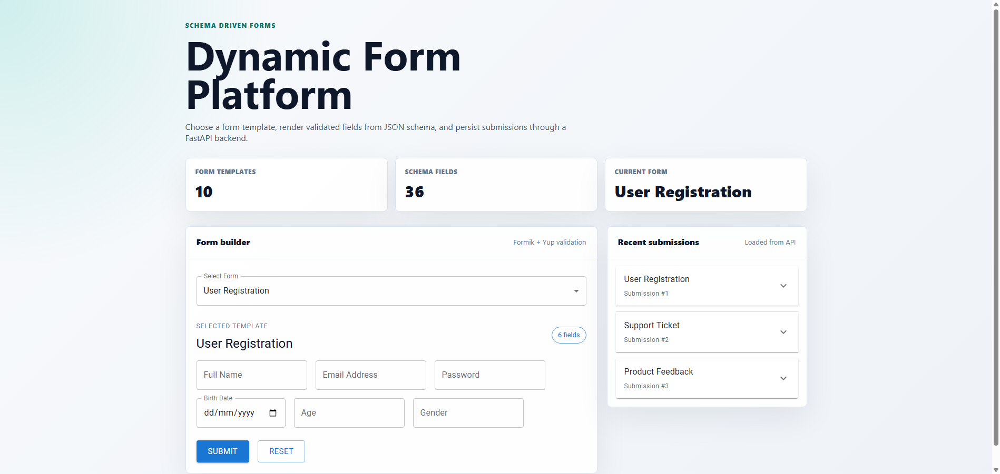
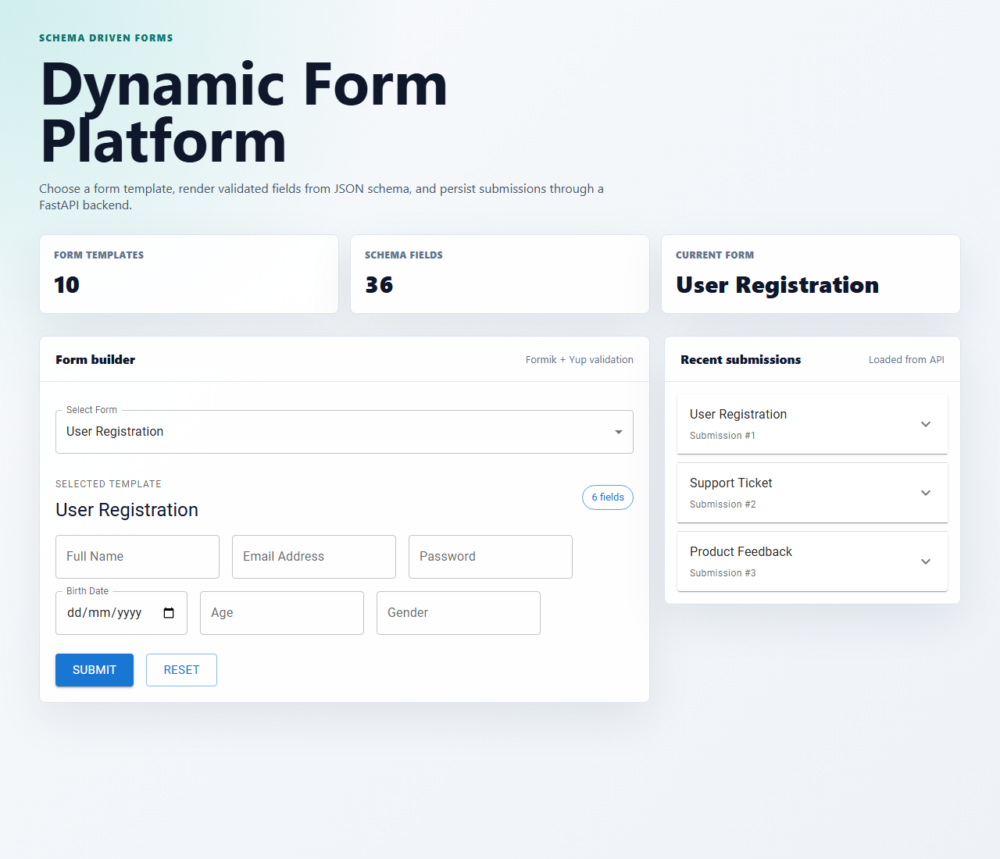

# Dynamic Form Platform

A full-stack form platform that renders forms from JSON schema, validates user input on the client, and stores submitted payloads through a FastAPI backend.

## Screenshots

### Form Workspace

The main workspace lets users choose a form template, review generated fields, and submit validated data.



### Saved Submissions

Submitted forms are persisted through the API and shown in a recent submissions panel.



## What The Project Does

- Renders multiple forms from reusable JSON schema definitions.
- Supports text, email, number, and dropdown fields.
- Builds Yup validation rules dynamically from each field schema.
- Submits form data to a FastAPI API.
- Stores submissions in PostgreSQL using SQLAlchemy.
- Prevents duplicate submissions on the backend.
- Shows saved submissions in the client UI.
- Runs as a complete client, API, and database stack with Docker Compose.

## Tech Stack

| Layer | Tools |
|---|---|
| Frontend | React, Vite, Material UI, Formik, Yup, Axios |
| Backend | FastAPI, SQLAlchemy, Pydantic, Uvicorn |
| Database | PostgreSQL |
| Workflow | Docker Compose, environment-based configuration |

## Run With Docker

```bash
docker compose up --build
```

Then open:

- Client: http://localhost:5174
- API: http://localhost:8001
- API docs: http://localhost:8001/docs

## Run Locally

Create environment files from the examples:

```bash
copy .env.example .env
copy server\.env.example server\.env
```

Start PostgreSQL with Docker or your local database, then run the API:

```bash
cd server
python -m venv .venv
.venv\Scripts\activate
pip install -r requirements.txt
uvicorn app.main:app --reload
```

Run the client:

```bash
cd client
npm install
npm run dev
```

## Repository Layout

```text
dynamic-form-platform/
  client/   React form UI
  server/   FastAPI submission API
  docs/     README screenshots
```
